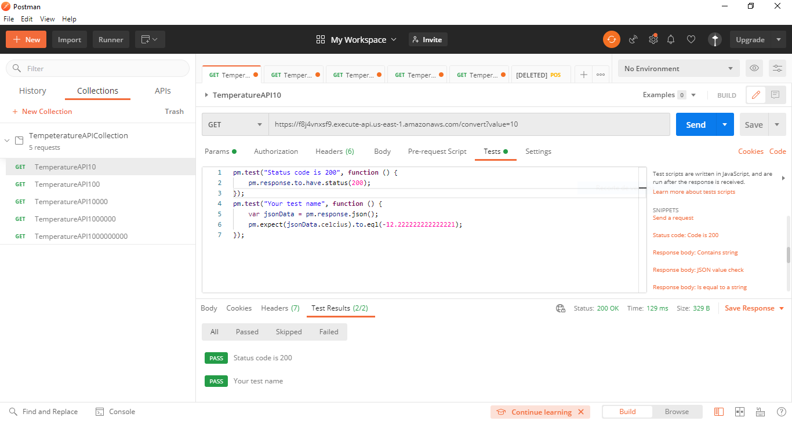
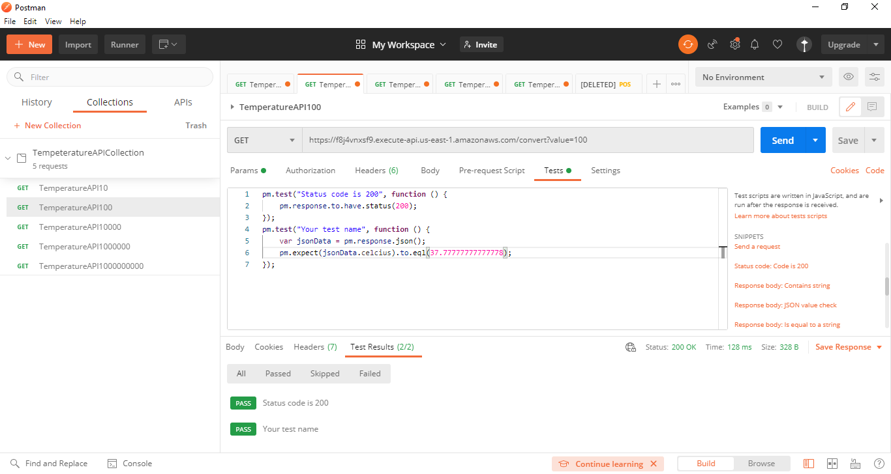
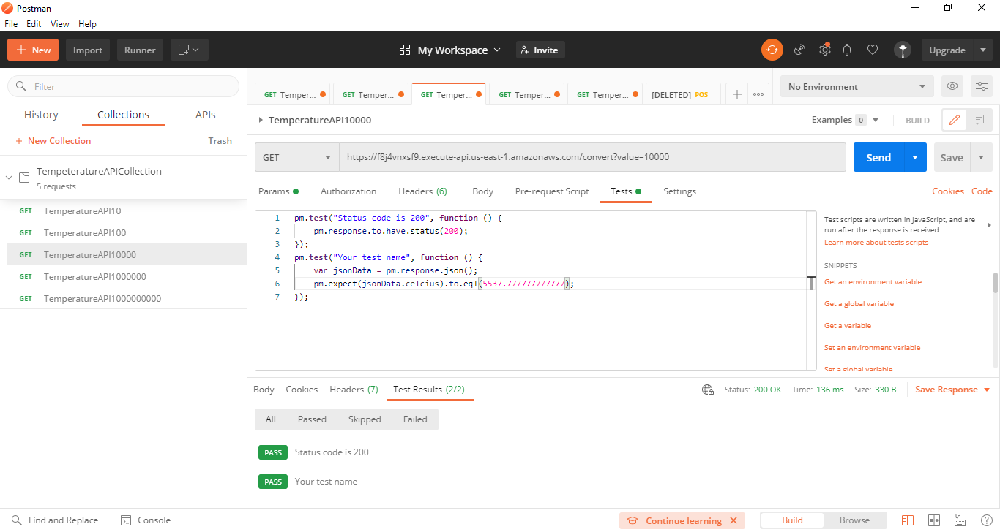
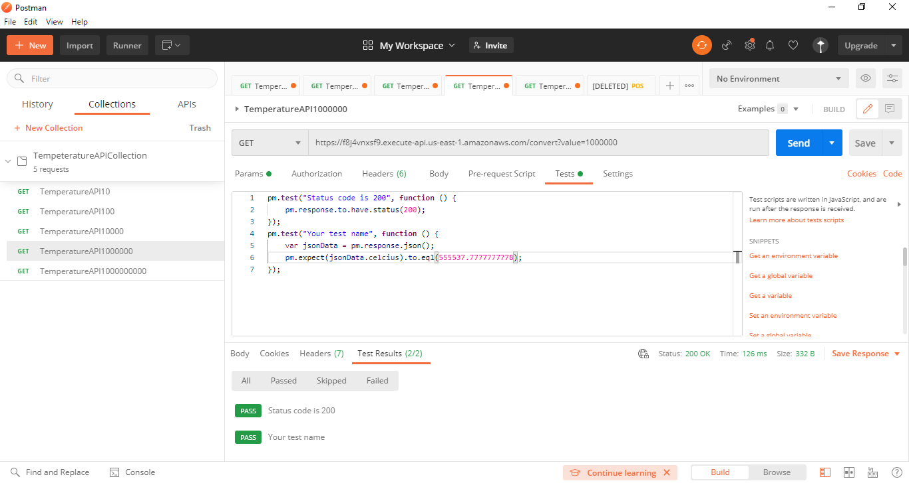
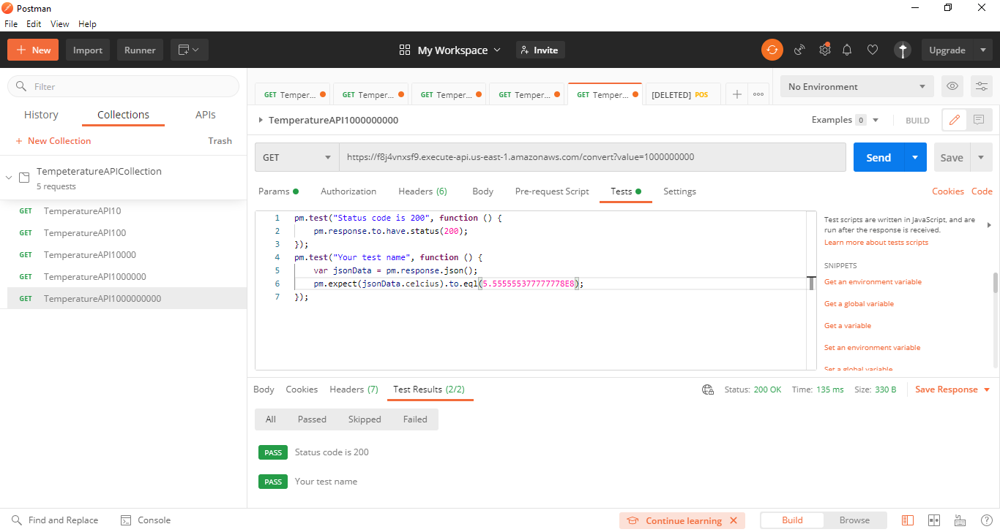

# Taller de Amazon Gateway y Lambda

### Pre-requisitos
Para hacer uso del software es necesario tener instalado:
* Java: Como lenguaje de programación                                      
    Siga las instrucciones en https://docs.oracle.com/en/java/javase/15/install/
* Maven: Automatiza y estandariza el flujo de vida de la construcción de software.                 
    Siga las instrucciones en http://maven.apache.org/download.cgi#Installation
* Git: Administrador descentralizado de configuraciones.                     
    Siga las instrucciones en http://git-scm.com/book/en/v2/Getting-Started-Installing-Git
* Docker Desktop: Automatizar el despliegue de aplicaciones dentro de contenedores de software                                   
    Siga las instrucciones en https://www.docker.com/products/docker-desktop

## Introducción 
1.  Cree un servicio Web en Spark que convierta de grados farenheit en grados celcius. El servicio debe responder un JSON.  
2.  Despliegue el servicio en una máquina de AWS EC2 y publíquelo.
3.  Cree una ruta en el API getway para acceder al servicio . Ojo ya la integración no es con función lambda.  
4.  Cree un aplicación JS para usar el servicio. Depliegue la aplicación en S3. Asegúrese que esté disponible sobre internet.  
5.  Pruebe la aplicación Web  
6.  Entregue el código desarrollado en Github, un reporte de las pruebas, y u video con el experimento funcionando.  
7.  Intente que el servicio en EC2 no esté accesible sobre internet, solo debe estar accesible por medio del API gateway.

## Pruebas
Se realizaron un total de 5 pruebas variando el valor de los grados farenheit, en cada prueba se aumenta el valor. Las pruebas se hicieron sobre el API gateway, haciendo peticiones GET y utilizando **Postman** para validar que el código retornado sea el 200 y el valor de los grados celsius sea el correcto,

En esta prueba se hace la conversión de 10 grados farenheit a grados celsius

En esta prueba se hace la conversión de 100 grados farenheit a grados celsius

En esta prueba se hace la conversión de 10000 grados farenheit a grados celsius

En esta prueba se hace la conversión de 1000000 grados farenheit a grados celsius

En esta prueba se hace la conversión de 1000000000 grados farenheit a grados celsius

## Funcionamiento
En el siguiente video se muestra el funcionamiento de la aplicación:

## Construido con 
* [Maven](https://maven.apache.org/) - Manejador de dependencias
* [Git](https://github.com/) - Control de versionamiento
* [Docker](https://www.docker.com/) - Administrador de contenedores 
* [EC2](https://aws.amazon.com/es/ec2/) - Plataforma de despliegue
* [API Gateway](https://aws.amazon.com/es/api-gateway/) - Admnistrador de API REST, HTTP y WebSocket
* [S3](https://aws.amazon.com/es/s3/) - Almacenador de objetos
* [Circle CI]() - Integración Continua

## Autores 
* [Germán Andrés Ospina Quintero](https://github.com/germanAOQ)

## Licencia 📄
Este proyecto esta licenciado por GNU General Public License v3.0
